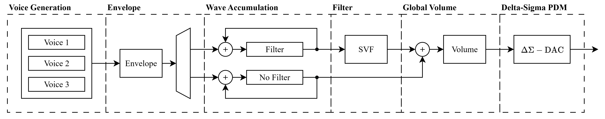

<!---

This file is used to generate your project datasheet. Please fill in the information below and delete any unused
sections.

You can also include images in this folder and reference them in the markdown. Each image must be less than
512 kb in size, and the combined size of all images must be less than 1 MB.
-->

## How it works

Inspired by the legendary MOS6581 Sound Interface Device (SID) chip used in retro computers such as the Commodore 64, the _Tiny Tapeout_ 6581 (TT6581) is a original digital interpretation supporting nearly the entire original MOS6581 feature set, implemented in 2x2 tiles for Tiny Tapeout.

All configuration is done via a 4-wire SPI interface, and the audio output is a 1-bit PDM signal at 10 MHz.

### Features

- Full control through a Serial-Peripheral Interface (SPI).
- Three independently synthesized voices.
- Four supported waveform types (triangle, sawtooth, square and noise).
- Attack, decay, sustain, release (ADSR) envelope shaping.
- Chamberlin State-Variable Filter (SVF) for low-pass, high-pass, band-pass and band-reject.
- Second-order Delta-Sigma DAC.

### Architecture



1. **Voice Generation:** One 10-bit voice at a time is generated. Internal phase registers keep track of each voice's state while inactive. The frequency and waveform type are set by the programmed values in the register file. Supported waveforms are triangle, sawtooth, pulse or noise.

2. **Envelope:** An ADSR envelope generator produces an 8-bit amplitude value per voice. The envelope is applied to each voice by multiplication using a shared 24×16 shift-add multiplier.

3. **Wave Accumulation:** The three voices are accumulated (mixed) by addition. Depending on the filter enable bit of each voice, they are accumulated in one of two registers: one that will be passed through the SVF, and one that will bypass it.

4. **Filter:** A Chamberlin State-Variable Filter (SVF) processes the filter accumulator. It supports low-pass, high-pass, band-pass and band-reject modes with tuneable frequency cutoff and resonance (Q).

5. **Global Volume:** The SVF output is summed with the bypass accumulator. A global 8-bit volume is applied by multiplication resulting in the final mix.

6. **Delta-Sigma PDM:** An error-feedback Delta-Sigma modulator converts the final mix to a 1-bit PDM output at 10 MHz (OSR = 200).

### Pin Mapping

The TT6581 uses the bidirectional IO pins for SPI and a single dedicated output for the PDM audio signal. All dedicated inputs are unused.

| Pin        | Direction | Function                     |
| ---------- | --------- | ---------------------------- |
| `uio[0]`   | Input     | SPI Chip Select (active low) |
| `uio[1]`   | Input     | SPI MOSI                     |
| `uio[2]`   | Output    | SPI MISO                     |
| `uio[3]`   | Input     | SPI SCLK                     |
| `uio[4:7]` | -         | Unused                       |
| `uo[0]`    | Output    | PDM audio output             |
| `uo[1:7]`  | -         | Unused                       |
| `ui[0:7]`  | -         | Unused                       |

The PDM output should be passed through a 4th order Bessel filter for the best reconstruction of the analog waveform.

### Programming

The TT6581 is programmed in much the same way as the original MOS6581. The register layout mirrors the original SID, three voice channels followed by filter and volume registers and the same ADSR, waveform selection and filter concepts apply. The main differences are:

- Registers are accessed through an SPI interface.
- The filter coefficients are pre-calculated and written directly as fixed-point values, rather than the raw 11-bit FC value used by the MOS6581.

### SPI Protocol

The SPI interface uses CPOL=0, CPHA=0 (data sampled on the rising edge of SCLK). Each transaction is a 16-bit frame while CS is held low:

| Bit   | 15         | 14:8            | 7:0          |
| ----- | ---------- | --------------- | ------------ |
| Field | R/W        | Address \[6:0\] | Data \[7:0\] |

- **Bit 15** = `1` for write, `0` for read.
- **Bits 14:8** = 7-bit register address.
- **Bits 7:0** = write data.

Data is transmitted MSB first.

### Playing a tone

1. **Set volume:** Write `0xFF` to register `0x1A` (VOLUME) for full volume.
2. **Set frequency:** Compute the 16-bit frequency control word and write it to `FREQ_LO` / `FREQ_HI`.
3. **Set ADSR:** Write attack/decay to `AD` and sustain/release to `SR`.
4. **Select waveform and gate on:** Write the CONTROL register with the desired waveform bit and `GATE=1`.

For example, to play a 440 Hz sawtooth on Voice 0 with instant attack and full sustain:

```
SPI Write: addr=0x1A, data=0xFF    # Volume = max
SPI Write: addr=0x00, data=0x05    # FREQ_LO = 0x05  (FCW for 440 Hz = 0x1205)
SPI Write: addr=0x01, data=0x12    # FREQ_HI = 0x12
SPI Write: addr=0x05, data=0x00    # AD = 0x00 (attack=0, decay=0)
SPI Write: addr=0x06, data=0xF0    # SR = 0xF0 (sustain=15, release=0)
SPI Write: addr=0x04, data=0x21    # CONTROL = sawtooth + gate on
```

To release the note, write CONTROL again with `GATE=0`:

```
SPI Write: addr=0x04, data=0x20    # CONTROL = sawtooth + gate off
```

### Formulas

**Frequency Control Word (FCW):**

$$
FCW = \frac{f_{\text{desired}} \times 2^{19}}{F_s}
$$

where $F_s = 50$ kHz (sample rate). The 16-bit FCW is split across `FREQ_LO` (bits 7:0) and `FREQ_HI` (bits 15:8).

**Filter Cutoff Coefficient** (Q1.15 signed):

$$
\text{FCC} = \left[ 2 \cdot \sin \left( \frac{\pi \cdot f_c}{F_s} \right) \cdot 32768 \right]
$$

where $f_c$ is the desired cutoff frequency in Hz. The 16-bit result is split across `F_LO` and `F_HI`.

**Filter Damping Coefficient** (Q4.12 signed):

$$
\text{FDC} = \left[ \frac{1}{Q} \cdot 4096 \right]
$$

where $Q$ is the desired resonance. The 16-bit result is split across `Q_LO` and `Q_HI`.

### Register map summary

The TT6581 has a 7-bit address space (128 registers). Three identical voice register groups are followed by a filter/volume group.

The full register map is described in `regs.yaml`.

#### Voice Registers

Each voice occupies 7 consecutive registers. Voice 0 starts at `0x00`, Voice 1 at `0x07`, and Voice 2 at `0x0E`.

| Offset | Name    | Bits | Description                        |
| ------ | ------- | ---- | ---------------------------------- |
| 0x00   | FREQ_LO | 7:0  | Frequency control word - low byte  |
| 0x01   | FREQ_HI | 7:0  | Frequency control word - high byte |
| 0x02   | PW_LO   | 7:0  | Pulse width - low byte             |
| 0x03   | PW_HI   | 3:0  | Pulse width - high byte            |
| 0x04   | CONTROL | 7:0  | Waveform select and voice control  |
| 0x05   | AD      | 7:0  | Attack (7:4) / Decay (3:0)         |
| 0x06   | SR      | 7:0  | Sustain (7:4) / Release (3:0)      |

**CONTROL register bit fields:**

| Bit | Name     | Description                    |
| --- | -------- | ------------------------------ |
| 7   | NOISE    | Select noise waveform          |
| 6   | PULSE    | Select pulse (square) waveform |
| 5   | SAW      | Select sawtooth waveform       |
| 4   | TRI      | Select triangle waveform       |
| 3   | -        | Reserved                       |
| 2   | RING_MOD | Enable ring modulation         |
| 1   | SYNC     | Enable oscillator sync         |
| 0   | GATE     | Gate (1 = attack, 0 = release) |

#### Filter and Volume Registers

| Address | Name    | Bits | Description                            |
| ------- | ------- | ---- | -------------------------------------- |
| 0x15    | F_LO    | 7:0  | Filter cutoff coefficient - low byte   |
| 0x16    | F_HI    | 7:0  | Filter cutoff coefficient - high byte  |
| 0x17    | Q_LO    | 7:0  | Filter damping coefficient - low byte  |
| 0x18    | Q_HI    | 7:0  | Filter damping coefficient - high byte |
| 0x19    | EN_MODE | 5:0  | Filter enable and mode select          |
| 0x1A    | VOLUME  | 7:0  | Global volume (0x00–0xFF)              |

**EN_MODE bit fields:**

| Bit | Name    | Description                                         |
| --- | ------- | --------------------------------------------------- |
| 5   | FILT_V2 | Route Voice 2 through filter                        |
| 4   | FILT_V1 | Route Voice 1 through filter                        |
| 3   | FILT_V0 | Route Voice 0 through filter                        |
| 2:0 | MODE    | Filter mode: `001`=LP, `010`=BP, `100`=HP, `101`=BR |

## How to test

1. Connect an SPI master to the bidirectional IO pins:
    - `uio[0]` = CS (active low)
    - `uio[1]` = MOSI
    - `uio[2]` = MISO
    - `uio[3]` = SCLK

2. Connect `uo[0]` (PDM output) through a low-pass reconstruction filter (e.g. 4th-order Bessel, cutoff ≈ 20 kHz) to an amplifier or speaker.

3. Program a voice — minimal example for a 440 Hz sawtooth:
    - Write `0xFF` to `0x1A` (volume = max).
    - Write `0x05` to `0x00` and `0x12` to `0x01` (frequency control word for 440 Hz).
    - Write `0x00` to `0x05` (attack=0, decay=0) and `0xF0` to `0x06` (sustain=15, release=0).
    - Write `0x21` to `0x04` (sawtooth waveform + gate on).

4. A 440 Hz sawtooth tone _should_ be playing. Write `0x20` to `0x04` to release the note.

The project also includes a CocoTB test suite that runs automatically via GitHub Actions on both RTL and the synthesized gate-level netlist.

## External hardware

- SPI master
- Low-pass reconstruction filter for the PDM output (e.g. passive RC or active Bessel filter, cutoff ≈ 20 kHz).
- Audio amplifier and speaker/headphones
